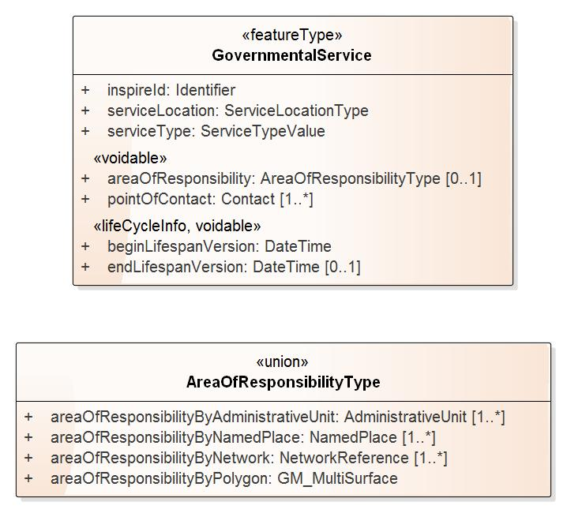

[[ref_cr]]
= Schema conversion rules

This chapter documents the rules for converting an INSPIRE application schema to an OWL ontology

== General

Rules for the conversion of an application schema package, the UML types it contains, and the properties of these types, are documented in this chapter.

[[ref_cr_general_documentation]]
=== Documentation

The documentation of UML elements (types, attributes and association roles) in INSPIRE application schemas includes:

* A natural / human readable name
* A definition
* A description (optional)

[REQUIREMENT, id="REQ/OWL/documentation"]
======
The natural / human readable name, definition, and description (if available) of a UML element shall be documented using properties as shown in <<ref_cr_general_documentation_table,the following table>>. The values of these properties shall be provided at least in English.

======

[[ref_cr_general_documentation_table]]
.Encoding of common documentation items
[width="90%",options="header"]
|====================
| Documentation item | Encoding with RDF/OWL property
| natural / human readable name | rdfs:label
| definition | skos:definition
| description | rdfs:comment
|====================

.Documentation of an OWL class
======
[underline]#RDF/Turtle serialization#
[source,turtle,linenumbers]
----------
cp:CadastralParcel  a          owl:Class ;
        rdfs:comment           "SOURCE [INSPIRE Directive:2007].\r\n\r\nNOTE As much as possible, in the INSPIRE context, cadastral parcels should be forming a partition of national territory. Cadastral parcel should be considered as a single area of Earth surface (land and/or water), under homogeneous real property rights and unique ownership, real property rights and ownership being defined by national law (adapted from UN ECE 2004 and WG-CPI, 2006). By unique ownership is meant that the ownership is held by one or several joint owners for the whole parcel."@en ;
        skos:definition        "Areas defined by cadastral registers or equivalent."@en .
----------

[underline]#RDF/XML serialization#
[source,xml,linenumbers]
----------
  <owl:Class rdf:about="http://inspire.ec.europa.eu/ont/cp#CadastralParcel">
   <rdfs:comment xml:lang="en">SOURCE [INSPIRE Directive:2007].&#xD;
&#xD;
NOTE As much as possible, in the INSPIRE context, cadastral parcels should be forming a partition of national territory. Cadastral parcel should be considered as a single area of Earth surface (land and/or water), under homogeneous real property rights and unique ownership, real property rights and ownership being defined by national law (adapted from UN ECE 2004 and WG-CPI, 2006). By unique ownership is meant that the ownership is held by one or several joint owners for the whole parcel.</rdfs:comment>
    <skos:definition xml:lang="en">Areas defined by cadastral registers or equivalent.</skos:definition>
  </owl:Class>
----------
======

[[schema_conversion_pkg]]
== Application schema package

[REQUIREMENT, id="REQ/OWL/ontology"]
======
An application schema shall be converted into a single OWL ontology.

The UML types belonging to the namespace of the schema shall be converted as defined in this document.

======

No specific conversion rules are defined for the packages that belong to an application schema. These packages usually have the stereotype \<<leaf>> or no stereotype. They are primarily used for structuring the conceptual schema.

.Declaration of the Cadastral Parcels ontology
======
[underline]#RDF/Turtle serialization#
[source,turtle,linenumbers]
----------
<http://inspire.ec.europa.eu/ont/cp>
        a                owl:Ontology ;
        owl:imports      <http://def.isotc211.org/iso19150-2/2012/base> , <https://github.com/inspire-eu-rdf/inspire-rdf-vocabularies/blob/master/ad/ad.ttl> , <https://www.w3.org/ns/locn.ttl> , <http://www.w3.org/2004/02/skos/core> , <http://www.opengis.net/ont/geosparql> , <https://github.com/inspire-eu-rdf/inspire-rdf-vocabularies/blob/master/base/base.ttl> , <https://github.com/inspire-eu-rdf/inspire-rdf-vocabularies/blob/master/au/au.ttl> ;
        owl:versionIRI   "http://inspire.ec.europa.eu/ont/cp/4.0" ;
        owl:versionInfo  "4.0" ;
        skos:definition  "The application schema CadastralParcels contains the feature types CadastralParcel, CadastralBoundary and CadastralIndexSet."@en .

----------

[underline]#RDF/XML serialization#
[source,xml,linenumbers]
----------
  <owl:Ontology rdf:about="http://inspire.ec.europa.eu/ont/cp">
    <owl:imports rdf:resource="http://def.isotc211.org/iso19150-2/2012/base"/>
    <owl:imports rdf:resource="https://github.com/inspire-eu-rdf/inspire-rdf-vocabularies/blob/master/ad/ad.ttl"/>
    <owl:imports rdf:resource="https://www.w3.org/ns/locn.ttl"/>
    <skos:definition xml:lang="en">The application schema CadastralParcels contains the feature types CadastralParcel, CadastralBoundary and CadastralIndexSet.</skos:definition>
    <owl:versionInfo>4.0</owl:versionInfo>
    <owl:imports rdf:resource="http://www.w3.org/2004/02/skos/core"/>
    <owl:imports rdf:resource="http://www.opengis.net/ont/geosparql"/>
    <owl:imports rdf:resource="https://github.com/inspire-eu-rdf/inspire-rdf-vocabularies/blob/master/base/base.ttl"/>
    <owl:versionIRI>http://inspire.ec.europa.eu/ont/cp/4.0</owl:versionIRI>
    <owl:imports rdf:resource="https://github.com/inspire-eu-rdf/inspire-rdf-vocabularies/blob/master/au/au.ttl"/>
  </owl:Ontology>
----------
======

[[ref_cr_pkg_name]]
=== Ontology name and namespace

[REQUIREMENT, id="REQ/OWL/ontology/name"]
======
The name of the ontology shall be constructed as follows:

    ontology-name = "http://inspire.ec.europa.eu/ont/" + app-schema-code

The _app-schema-code_ is specified by the tagged value _xmlns_ of the \<<applicationSchema>> package.

======

This scheme is similar but not equal to the URI scheme of INSPIRE GML Schemas. Re-using the namespace URIs of the INSPIRE GML Schemas for the INSPIRE RDF vocabularies has been considered. However, such an approach can lead to URI resolution conflicts (when trying to access an XML Schema and RDF vocabulary at the exact same URI) and has therefore been rejected.

.Ontology name for schema "CadastralParcels"
======
The ontology name of the INSPIRE RDF vocabulary for the \<<applicationSchema>> "CadastralParcels" is: http://inspire.ec.europa.eu/ont/cp

======

[REQUIREMENT, id="REQ/OWL/ontology/namespace"]
======
The namespace for the ontology components shall be: 

    ontology-namespace = ontology-name + "#"
======

Hash URIs - instead of 'slash' URIs (i.e. using '/') - are used in INSPIRE ontology namespaces for the following reasons:

* The expressions and axioms that comprise an INSPIRE ontology are often used together. In some cases there can be complex dependencies between concepts. Hash URIs ensure that a client receives all relevant information about these dependencies when it accesses the ontology.
* An ontology that is contained in a single document can easily be published.
* If a client recognizes that a specific term is defined by a hash URI, then it can download the ontology from this URI, cache it, and re-use it whenever another term with the same base URI is accessed. In other words, hash URIs support caching, and can thus reduce the number of HTTP round-trips and reduce access latency. The sice of the ontology document should be reasonably small, since it only contains the ontology components derived from one particular INSPIRE application schema.
* A slash URI can still be used for individuals, i.e. RDF resources that have an INSPIRE RDF/OWL class as type.

[CAUTION]
=======
Relevant issue(s):

* https://github.com/inspire-eu-rdf/inspire-rdf-guidelines/issues/26[URIs for INSPIRE - 303 URIs vs. hash URIs]
* https://github.com/inspire-eu-rdf/inspire-rdf-guidelines/issues/3[URI Scheme for RDF namespaces – management aspects]

=======

=== Version information

[REQUIREMENT, id="REQ/OWL/ontology/version"]
======
An owl:versionInfo predicate shall be added to the ontology, with the content of the _version_ tagged value of the \<<applicationSchema>> package as value.

The _version_ shall also be used to assign a _version IRI_ to the ontology, which is defined as follows:

    versionIRI = ontology-name + "/" + version
======

[RECOMMENDATION, id="REC/OWL/ontology/series"]
======
If the ontology is part of an ontology series, i.e. a set of different versions of an ontology, then it is recommended that the predicates owl:priorVersion, owl:backwardCompatibleWith, owl:incompatibleWith are assigned to the ontology as appropriate.

======

Checking that a new version of an ontology is or is not compatible with the prior version of the ontology typically requires manual inspection.

=== Imports

[REQUIREMENT, id="REQ/OWL/ontology/imports"]
======
If the ontology uses entities of an external ontology, it shall use an owl:imports predicate to import the external ontology.

======

[[ref_cr_type]]
== Types

An INSPIRE application schema contains a set of UML types, i.e. classes. This chapter contains rules for converting the different categories of UML types that occur in INSPIRE application schemas, namely: spatial object types, data types, unions, enumerations, and code lists. The rules for converting UML properties are documented in a <<ref_cr_prop,separate chapter>>.

It is good practice to re-use already established classes when converting an INSPIRE application schema into an ontology. With respect to UML types, that means that a UML type can be implemented by an existing RDFS/OWL class, rather than creating a new OWL class to represent the type. In other words, the UML type is mapped to an existing RDFS/OWL class. This approach has also been applied in the GML encoding of INSPIRE application schemas. There, base types, for example from ISO schemas, are implemented by / mapped to XML elements that are defined in existing XML Schemas. +
If a mapping exists for a UML type, the type is not converted. Instead, the RDFS/OWL class defined by the mapping is used as the representation of the UML type (for example as the range of an OWL property, which represents a UML property that has the UML type as value type).

.Mappings for UML types
======
The UML type CharacterString from ISO 19103 is mapped to xsd:string, and the UML type MD_Metadata from ISO 19115 is mapped to dcat:Dataset.

======

If a UML type is converted to an RDFS/OWL class, then that class can be aligned with RDFS/OWL classes from other vocabularies. Our focus in this case is on inheriting semantics. An INSPIRE OWL class can be made a subclass of any number of RDFS/OWL classes (via the predicate rdfs:subClassOf), even if the UML model does not provide such relationships (note that this is one of the fundamental differences between UML and RDF/OWL). This can be used to inherit characteristics that are defined by existing RDFS/OWL classes. 

.Alignment for spatial object types
======
<<ref_cr_type_feature_alignment,Spatial object types are aligned with GeoSPARQL features>>. This supports querying of INSPIRE spatial object types at SPARQL endpoints that support GeoSPARQL.

======

Mapping and alignment facilitate re-use of ontologies and are often used by the linked data community.

NOTE: Because the information for mapping or aligning types can be complex, it is not included in the UML model. Mappings and alignments are defined in human-readable documentation and/or configuration files (if the ontology is derived automatically using software).

[[ref_cr_mappings]]
=== Mappings

[RECOMMENDATION, id="REC/OWL/type/mapping"]
======

If an RDFS/OWL class from an existing vocabulary is known to appropriately represent the semantics of a UML type, then the type should be mapped to that class.

======

[PERMISSION, id="REC/OWL/type/mapping/simplification"]
======
If applications only need a subset of the information provided by an INSPIRE type, then that type may be mapped to an RDFS/OWL class from an existing vocabulary that only supports this subset.

======

.Simple mapping of a UML type
======
The INSPIRE type GeographicalName can be mapped to rdfs:Literal. For further details, see <<ref_cr_mappings_inspireGeographicalNames,here>>.

======

Whether or not a mapping is appropriate typically requires careful consideration. 

The following subsections document known mappings. They can be extended in the future.

[CAUTION]
=======
Relevant issue(s):

* https://github.com/inspire-eu-rdf/inspire-rdf-guidelines/issues/9[RDF types for base types from ISO 19103 - types that map directly to XML Schema types]
* https://github.com/inspire-eu-rdf/inspire-rdf-guidelines/issues/10[RDF types for base types from ISO 19103 - measure types]
* https://github.com/inspire-eu-rdf/inspire-rdf-guidelines/issues/11[RDF types for base types from ISO 19103 - ‘Any’ type]
* https://github.com/inspire-eu-rdf/inspire-rdf-guidelines/issues/12[RDF types and properties for INSPIRE foundation schemas]
* https://github.com/inspire-eu-rdf/inspire-rdf-guidelines/issues/16[Reuse of common Linked Data Vocabularies]
* https://github.com/inspire-eu-rdf/inspire-rdf-guidelines/issues/17[Including information for mapping classes and properties to common definitions in the conceptual model]

=======

[[ref_cr_mappings_iso19103]]
==== ISO 19103

[REQUIREMENT, id="REQ/OWL/type/mappings/iso/19103"]
======
Types from ISO 19103 shall be mapped to the RDFS/OWL class or datatype listed in <<ref_cr_types_table_mapping_iso19103,the following table>>.

======

[[ref_cr_types_table_mapping_iso19103]]
.Mapping of types from ISO 19103
[width="90%",options="header"]
|====================
| ISO 19103 Type | RDFS/OWL Class or Datatype
| Boolean | xsd:boolean
| CharacterString | xsd:string
| Date | xsd:date
| DateTime | xsd:dateTime
| Decimal | xsd:decimal
| Integer | xsd:integer
| Number | xsd:double
| Real | xsd:double
| Any | rdfs:Class
| Angle | #TBD#
| Area | #TBD#
| Distance | #TBD#
| Length | #TBD#
| Measure | #TBD#
| Probability | #TBD#
| Velocity | #TBD#
| Volume | #TBD#
| UnitOfMeasure | #TBD: rdfs:Class if no recommendation can be made#
|====================

For all other types from ISO 19103 used in INSPIRE schemas, suitable mappings need to be found on a case-by-case basis. 

[[ref_cr_mappings_iso19107]]
==== ISO 19107

[REQUIREMENT, id="REQ/OWL/type/mappings/iso/19107/geosparql"]
======
Types from ISO 19107 shall be mapped to the <<ogc_geosparql,GeoSPARQL>> _Geometry_ class or one of its subclasses.

======

The http://eur-lex.europa.eu/legal-content/EN/TXT/?uri=CELEX%3A02010R1089-20131230[Commission Regulation (EU) No 1089/2010 of 23 November 2010 implementing Directive 2007/2/EC of the
 European Parliament and of the Council as regards interoperability of spatial data sets and services] states (in combination with its http://eur-lex.europa.eu/legal-content/EN/TXT/?uri=celex:32013R1253[amendmend from 2013]) the following:

[quote, Commission Regulation (EU) No 1089/2010]
______
The value domain of spatial properties defined in this Regulation shall be restricted to the Simple Feature spatial schema as defined in Herring, John R. (ed.), OpenGIS® Implementation Standard for Geographic information – Simple feature access – Part 1: Common architecture, version 1.2.1, Open Geospatial Consortium, 2011, unless specified otherwise for a specific spatial data theme or type.
______

The INSPIRE themes "Cadastral Parcels" and "Buildings" make exceptions to the rule that the domain of spatial properties shall be restricted to Simple Feature geometries. The cadastral parcels theme allows geometries with circular arcs, while the buildings theme allows 3D geometries.

[REQUIREMENT, id="REC/OWL/type/mappings/iso/19107/mapping"]
======
If a type from ISO 19107 that is used in an INSPIRE application schema can be implemented as a Simple Feature geometry, then the type shall be mapped to one of the classes from the ontology available at http://www.opengis.net/ont/sf (Simple Feature ontology). Otherwise, the type shall be mapped to one of the classes from the ontology available at http://www.opengis.net/ont/gml (GML ontology). See the <<ref_cr_types_table_mapping_iso19107,following table>> for a list of applicable mappings.

======

NOTE: Both ontologies define a hierarchy of subclasses of the GeoSPARQL Geometry class.

[[ref_cr_types_table_mapping_iso19107]]
.Mapping of types from ISO 19107 to their implementations as GeoSPARQL Geometry subclasses
[width="90%",options="header"]
|====================
| ISO 19107 Types | http://www.opengis.net/ont/sf[Simple Feature Ontology] Class | http://www.opengis.net/ont/gml[GML Ontology] Class
| GM_Aggregate | sfowl:GeometryCollection | gmlowl:MultiGeometry
| GM_Curve | sfowl:LineString | gmlowl:Curve or gmlowl:LineString
| GM_MultiCurve | sfowl:MultiLineString | gmlowl:MultiCurve
| GM_MultiPoint | sfowl:MultiPoint | gmlowl:MultiPoint
| GM_MultiPrimitive | sfowl:GeometryCollection | gmlowl:MultiGeometry
| GM_MultiSurface | sfowl:MultiPolygon | gmlowl:MultiSurface
| GM_Object | sfowl:Geometry | gmlowl:AbstractGeometry
| GM_Point | sfowl:Point | gmlowl:Point
| GM_PolyhedralSurface | sfowl:PolyhedralSurface | gmlowl:PolyhedralSurface
| GM_Primitive | sfowl:Geometry | gmlowl:AbstractGeometricPrimitive
| GM_Ring | sfowl:LinearRing | gmlowl:Ring or gmlowl:LinearRing
| GM_Solid | - | gmlowl:Solid
| GM_Surface | sfowl:Polygon | gmlowl:Surface or gmlowl:Polygon
| GM_Tin | sfowl:TIN | gmlowl:Tin
| GM_Triangle | sfowl:Triangle | gmlowl:Triangle
|====================

[[ref_cr_mappings_iso19108]]
==== ISO 19108

[REQUIREMENT, id="REQ/OWL/type/mappings/iso/19108"]
======
Types from ISO 19108 shall be mapped to the RDFS/OWL class or datatype listed in the <<ref_cr_types_table_mapping_iso19108,following table>>.

======

[[ref_cr_types_table_mapping_iso19108]]
.Mapping of types from ISO 19108
[width="90%",options="header"]
|====================
| ISO 19108 Type | RDFS/OWL Class or Datatype
| TM_Position | #TBD:# http://www.w3.org/2006/time#Instant - and for simple cases xsd:date and xsd:dateTime?
|====================

For all other types from ISO 19108 used in INSPIRE schemas, suitable mappings need to be found on a case-by-case basis. 

////
TM_Position:

http://www.w3.org/2006/time#Instant appears to support the complexity of the ISO type. However, in most cases xsd:dateTime should suffice. A time:Instant can also be expressed as an xsd:dateTime. Would the extra step (through a time:Interval instance) be an issue for users? Maybe TM_Position can be mapped on a case by case basis, to time:Interval if full complexity is necessary, and xsd:date as well as xsd:dateTime if only a simple date with/without time is needed.

////

[[ref_cr_mappings_iso19115]]
==== ISO 19115

[REQUIREMENT, id="REQ/OWL/type/mappings/iso/19115"]
======
Types from ISO 19115 shall be mapped to the RDFS/OWL class or datatype listed in the <<ref_cr_types_table_mapping_iso19115,following table>>.

======

[[ref_cr_types_table_mapping_iso19115]]
.Mapping of types from ISO 19115
[width="90%",options="header"]
|====================
| ISO 19115 Type | RDFS/OWL Class or Datatype
| CI_Citation | #TBD#
| MD_Metadata | dcat:Dataset
| MD_Resolution | rdf:langString
| URL | xsd:anyURI
|====================

For all other types from ISO 19115 used in INSPIRE schemas, suitable mappings need to be found on a case-by-case basis. 

[NOTE]
======
* The approach to map the complex type MD_Resolution to a simple (language tagged) string follows the approach chosen by GeoDCAT-AP (which maps the spatial resolution of a dataset, represented by an instance of MD_Resolution, to rdfs:comment; see <<geodcat_ap,GeoDCAT-AP Annex II, section II.13>> for further details). By only mapping the type MD_Resolution to rdf:langString, we can preserve the semantics of INSPIRE properties that have MD_Resolution as type.
* The data type CI_Date combines a date(time) with a code that provides the semantic for that date: date of creation, publication, and revision. At the moment, CI_Date is only used by the INSPIRE type DocumentCitation, which is one of the base types. Following the example from GeoDCAT-AP, an instance of CI_Date that uses one of the three date type codes (creation, publication, revision) can be implemented using one of the three properties dct:created, dct:issued, and dct:modified. This mapping is specified in the <<ref_instance_metadata,chapter on conversion of metadata instances>>.
======

////
CI_Date: 

GeoDCAT-AP appears to map a property with value type CI_Date to three properties, which can be assigned in instance data as appropriate: dct:created, dct:issued, dct:modified. These properties represent the semantics of a CI_Date, which is a complex type that includes a Date or DateTime and a code for the type of date (creation, publication, revision). DCT created, issued, and modified have rdfs:Literal as range, and thus can have an xsd:date and xsd:dateTime as value. This approach would not preserve any specific semantics of the INSPIRE property that has type CI_Date (though the semantic is probably already provided by the type of date). The only place where CI_Date appears to be used in the current INSPIRE model is in DocumentCitation. And there the UML property "date" appears to match exactly the concept of a union of DCT created, issued, and modified.

If we want to encode a property with type CI_Date and keep the definition of that property, we need to define a range that appropriately represents a CI_Date. It is not clear if an appropriate RDFS/OWL class or data type already exists. OWL representations are available at https://github.com/ISO-TC211/GOM. It's not clear if these will be standardized at some point in time. Apparently they are maintained by the ISO TC 211 GOM. Also, if we re-use these ontologies, should this also be done in other cases, for example MD_Metadata? Note that we do re-use the ontology from ISO 19150-2 (like iso19150-2:isAbstract and iso19150-2:constraint). Would encoding an instance of MD_Metadata as both 1) a DCAT Dataset (GeoDCAT-AP compliant) and 2) a class from the GOM ontologies lead to inconsistencies or conflicts? Would it be clear which properties belong to the simplified GeoDCAT-AP view and which belong to the complex GOM view?

We could also define a our own encoding of CI_Date in the base0 ontology, most likely as a class. But that's reinventing the wheel, most likely. Also, at the moment INSPIRE schemas use CI_Date only in class DocumentCitation.

CI_Citation:
Implement as xsd:anyURI? Consider GOM as well.
////

==== ISO 19139

[REQUIREMENT, id="REQ/OWL/type/mappings/iso/19139"]
======
Types from ISO 19139 shall be mapped to the RDFS/OWL class or datatype listed in the <<ref_cr_types_table_mapping_iso19115,following table>>.

======

[[ref_cr_types_table_mapping_iso19139]]
.Mapping of types from ISO 19139
[width="90%",options="header"]
|====================
| ISO 19139 Type | RDFS/OWL Class or Datatype
| PT_FreeText | rdf:langString
|====================

For all other types from ISO 19115 used in INSPIRE schemas, suitable mappings need to be found on a case-by-case basis. 

////
==== GeoSciML and EarthResourceML

#TBD: According to Simon Cox (via private email conversation), no systematic conversion of the GeoSciML and EarthResourceML schemas exists yet. Ontologies would have to be derived from the schemas. If the INSPIRE registry does not contain RDF representations of all code lists yet, then http://resource.geosciml.org/ might provide them. According to Clemens Portele, the registry does contain the code lists.#
////

[[ref_cr_mappings_inspireAddresses]]
==== INSPIRE Annex I - Addresses

[PERMISSION, id="PMS/OWL/mappings/inspire/AddressRepresentation"]
======
The data type "AddressRepresentation" from _INSPIRE Annex I - Addresses_ may be mapped to class "Address" from the ISA Core Location Vocabulary. 
======

locn:Address provides a simplified encoding of the "AddressRepresentation" type, which can be sufficient for a given use case. However, for use cases that require complex information as defined by the INSPIRE Address application schema, an OWL encoding of that schema will be needed. 

// The class that represents the type "AddressRepresentation" could then be aligned to the ISA Core Location Vocabulary class "Adress" through subsumption, i.e. an rdfs:subClassOf relationship.#

[[ref_cr_mappings_inspireGeographicalNames]]
==== INSPIRE Annex I - Geographical Names

The INSPIRE type "GeographicalName" supports the provision of multiple spellings for a name, a link to an audio file for pronunciation, and more. Applications often simply just need the name in one spelling, potentially with indication of the language. In such cases, a simplification is possible.

[[ref_pms_owl_mappings_inspire_geographicalName_simpleLabel]]
[PERMISSION, id="PMS/OWL/mappings/inspire/GeographicalName/SimpleLabel"]
======
The data type "GeographicalName" from _INSPIRE Annex I - Geographical Names_ may be mapped to rdfs:Literal. 
======

If the indication of language is needed, rdf:langString can be used instead of rdfs:Literal, since rdf:langString is a subclass of rdfs:Literal.

The INSPIRE spatial object type "NamedPlace" combines a geometry with one or more names, and thus has a more complex base model (ignoring voidable properties) than "GeographicalName". A simple mapping for "NamedPlace" is currently not available.

[underline]#Simple or complex encoding#

It is <<ref_req_owl_property_alignment_locn_geographicName,required>> that properties with INSPIRE GeographicalName as value type are aligned with the <<w3c_locn,ISA Programme Location Core Vocabulary>> property "geographicName".

The https://www.w3.org/ns/locn#locn:geographicName[definition of locn:geographicName] states: _"For INSPIRE-conformant data, provide the metadata for the geographic name using a skos:Concept as a datatype."_ That can easily be achieved.

Encoding a geographical name as an individual resource can be useful if complex information is available for the name, instead of just a simple label. In that case, the SKOS properties _prefLabel_ and _altLabel_ can be used to provide labels for the name in multiple languages, while also distinguishing preferred from alternative labels.
Another case where the encoding of a geographical name as an individual resource can be useful is comparison of geographical names: if two spatial objects have "name" predicates with the same URI, then both spatial objects have the same geographic name. Resource equality can be asserted through a simple comparison of resource identifiers (the URIs). A comparison of pure labels, potentially given in different languages or spellings, would be more complex.

However, as stated before, it is allowed to map an INSPIRE _GeographicalName_ to a simple rdfs:Literal.

[CAUTION]
=======
Relevant issue(s):

* https://github.com/inspire-eu-rdf/inspire-rdf-guidelines/issues/28[Encoding of geographical names]

=======

[[ref_cr_type_name]]
=== Class name

[REQUIREMENT, id="REQ/OWL/type/name"]
======
The name of the RDFS/OWL class or datatype that represents a UML type shall be encoded as: 

    class-name = ontology-namespace normalized-UML-type-name
    
======

The normalization of a UML type name includes:

* Ensuring that it is given in UpperCamelCase.
* Replacing punctuation characters other than dash and underscore with underscore characters.
* Removing any space characters.

[[ref_cr_type_abstract]]
=== Abstractness

[REQUIREMENT, id="REQ/OWL/type/abstract"]
======
An abstract type shall be annotated with the property iso19150-2:isAbstract, using the boolean value _true_.

======

[[ref_cr_type_inheritance]]
=== Inheritance

[REQUIREMENT, id="REQ/OWL/type/inheritance"]
======
If the UML type A is a subtype of another UML type B, then an rdfs:subClassOf predicate shall be added to the OWL class representing A, with the IRI of the RDF representation of B as value.

======

In case of multiple inheritance, i.e. a UML type is subtype of more than one UML type, this would result in multiple rdfs:subClassOf predicates.

[[ref_cr_type_feature]]
=== Spatial object type

[REQUIREMENT, id="REQ/OWL/type/spatialobject"]
======
A spatial object type shall be converted to an OWL class.

======

[[ref_cr_type_feature_alignment]]
==== Alignment

[REQUIREMENT, id="REQ/OWL/type/spatialobject/geosparqlfeature"]
======
A spatial object type shall be an rdfs:subClassOf the <<ogc_geosparql,GeoSPARQL>> class "Feature".

======

This alignment will support querying of INSPIRE spatial object types encoded in RDF at SPARQL endpoints that support GeoSPARQL.

// This alignment should not add a conflicting ontological commitment

A GeoSPARQL feature is not required to have a geometry property. Thus, INSPIRE spatial object types for which the conceptual model does not define a geometry property, or which only have implicit geometry (for example provided by one or more linked spatial object types), are valid GeoSPARQL features.

.Aligning CadastralParcel to GeoSPARQL "Feature"
======
[underline]#RDF/Turtle serialization#
[source,turtle,linenumbers]
----------
cp:CadastralParcel  a          owl:Class ;
        rdfs:subClassOf        gsp:Feature .
----------

[underline]#RDF/XML serialization#
[source,xml,linenumbers]
----------
<owl:Class rdf:about="http://inspire.ec.europa.eu/ont/cp#CadastralParcel">
  <rdfs:subClassOf rdf:resource="http://www.opengis.net/ont/geosparql#Feature"/>
 </owl:Class>
----------
======

[CAUTION]
=======
Relevant issues:

* https://github.com/inspire-eu-rdf/inspire-rdf-guidelines/issues/7[Upper ontologies for INSPIRE spatial object types]

=======

[[ref_cr_type_feature_documentation]]
==== Documentation

[REQUIREMENT, id="REQ/OWL/type/spatialobject/documentation"]
======
The _inspireConcept_ tagged value of a spatial object type provides a URI reference to the feature concept in the INSPIRE Feature Concept Dictionary Register. An rdfs:isDefinedBy predicate with this URI shall be added to the OWL class that represents the spatial object type.

======

[[ref_cr_type_datatype]]
=== Data type

[REQUIREMENT, id="REQ/OWL/type/datatype"]
======
A data type shall be converted to an OWL class.

======

[[ref_cr_type_union]]
=== Union

A \<<union>> represents a choice between multiple properties. The properties can carry a specific meaning. They can have different value types. They can have a multiplicity other than exactly 1.

The \<<union>> can be represented in OWL using a logical combination of unqualified cardinality restrictions. The according class expression ensures that values are only given for one of the union properties.

However, if the \<<union>> was represented as an OWL class, then encoding of actual data would require the creation of individuals that just represent the "choice". A more natural approach would be to encode the "choice" where it is actually of interest, i.e. where the \<<union>> is used as value type.

[REQUIREMENT, id="REQ/OWL/type/union"]
======
A \<<union>> shall not be converted to an OWL class. Instead, it shall be transformed as follows:

* Each UML property (P) that has the \<<union>> as value type is replaced by new properties, one for each option (O) of the \<<union>>. 
** The name of a new property shall represent the specific combination of P and O, and shall be unique among the names of the properties that belong to the class that P belongs to.
*** NOTE: As shown in the two examples below, simply concatenating the property names - for example using the pattern "P-name '\_by_' O-name" is not always advisable. That is why the names of new properties can be assigned manually.
** The value type of the new property will be the value type of O. The multiplicity is set as follows: the lower bound is always 0, while the upper bound is the product of the maximum multiplicity of P and O - or unbounded if one of them is unbounded.
** The documentation (natural / human readable name, definition, description) of P and O are merged.
** The tagged values from O shall be used.
* For each UML property (P) that is replaced by new properties as described before AND that has a maximum multiplicity of one, create a logical combination of class expressions and add it to the class that P belongs to:
** For each new property (N): 
*** Create a set of unqualified cardinality restrictions, to express that the minimum cardinality of N is 0 (so there can be any number of values for this property, it can also be omitted completely), and the cardinality of the other new properties is restricted to exactly 0.
*** Combine the cardinality restrictions within an intersection class expression. The meaning of this expression is that if a value is given for N, then no values can be provided for the other new properties.
** Combine the intersection class expressions within a single OWL union class expression. This essentially represents the meaning of the \<<union>>: if a value is given for one of the options, then there must not be values for the other options.
** NOTE: If the maximum multiplicity of P is greater than one, then it can have values from more than one option. In that case, it would not be correct to add a class expression that restricts values to only one of the new properties.

======

EXAMPLE: The following <<image_union_example1,figure>> depicts the INSPIRE \<<union>> _Age_, and the \<<dataType>> _BiomarkerThematicMetadata_ where the value type of property _meanAge_ is _Age_.

[[image_union_example1]]
.\<<union>> Age - example from the INSPIRE model
image::images/union_example_age.jpg[]

The conversion results in (only showing BiomarkerThematicMetadata and the class expression that captures the \<<union>> semantics):

.Conversion of a union
======

[underline]#RDF/Turtle serialization#
[source,turtle,linenumber]
------
:BiomarkerThematicMetadata a owl:Class ;

   rdfs:subClassOf [ 
      a owl:Class ;
      owl:unionOf ( 
         [ owl:intersectionOf ( 
            [ a owl:Restriction ;
              owl:onProperty :meanAgeByMonth ;
              owl:minCardinality "0"^^xsd:integer]
            [ a owl:Restriction ;
              owl:onProperty :meanAgeByWeek ;
              owl:cardinality "0"^^xsd:integer]
            [ a owl:Restriction ;
              owl:onProperty :meanAgeByYear ;
              owl:cardinality "0"^^xsd:integer]) ;
         a owl:Class]
         [ owl:intersectionOf ( 
            [ a owl:Restriction ;
             owl:onProperty :meanAgeByMonth ;
             owl:cardinality "0"^^xsd:integer]
            [ a owl:Restriction ;
              owl:onProperty :meanAgeByWeek ;
              owl:minCardinality "0"^^xsd:integer]
            [ a owl:Restriction ;
              owl:onProperty :meanAgeByYear ;
              owl:cardinality "0"^^xsd:integer]) ;
         a owl:Class]
         [ owl:intersectionOf ( 
            [ a owl:Restriction ;
              owl:onProperty :meanAgeByMonth ;
              owl:cardinality "0"^^xsd:integer]
            [ a owl:Restriction ;
              owl:onProperty :meanAgeByWeek ;
              owl:cardinality "0"^^xsd:integer]
            [ a owl:Restriction ;
              owl:onProperty :meanAgeByYear ;
              owl:minCardinality "0"^^xsd:integer]) ;
         a owl:Class])] .
------

[underline]#RDF/XML serialization#
[source,xml,linenumbers]
------
<?xml version="1.0" encoding="UTF-8"?>
<rdf:RDF xmlns:rdf="http://www.w3.org/1999/02/22-rdf-syntax-ns#"
 xmlns:owl="http://www.w3.org/2002/07/owl#" xmlns:rdfs="http://www.w3.org/2000/01/rdf-schema#">
 <owl:Class rdf:about="http://inspire.ec.europa.eu/ont/hh#BiomarkerThematicMetadata">
  <rdfs:subClassOf>
   <owl:Class>
    <owl:unionOf>
     <rdf:Description>
      <rdf:first>
       <owl:Class>
        <owl:intersectionOf>
         <rdf:Description>
          <rdf:first>
           <owl:Restriction>
            <owl:onProperty rdf:resource="http://inspire.ec.europa.eu/ont/hh#meanAgeByMonth"/>
            <owl:minCardinality rdf:datatype="http://www.w3.org/2001/XMLSchema#integer"
             >0</owl:minCardinality>
           </owl:Restriction>
          </rdf:first>
          <rdf:rest>
           <rdf:Description>
            <rdf:first>
             <owl:Restriction>
              <owl:onProperty rdf:resource="http://inspire.ec.europa.eu/ont/hh#meanAgeByWeek"/>
              <owl:cardinality rdf:datatype="http://www.w3.org/2001/XMLSchema#integer"
               >0</owl:cardinality>
             </owl:Restriction>
            </rdf:first>
            <rdf:rest>
             <rdf:Description>
              <rdf:first>
               <owl:Restriction>
                <owl:onProperty rdf:resource="http://inspire.ec.europa.eu/ont/hh#meanAgeByYear"/>
                <owl:cardinality rdf:datatype="http://www.w3.org/2001/XMLSchema#integer"
                 >0</owl:cardinality>
               </owl:Restriction>
              </rdf:first>
              <rdf:rest rdf:resource="http://www.w3.org/1999/02/22-rdf-syntax-ns#nil"/>
             </rdf:Description>
            </rdf:rest>
           </rdf:Description>
          </rdf:rest>
         </rdf:Description>
        </owl:intersectionOf>
       </owl:Class>
      </rdf:first>
      <rdf:rest>
       <rdf:Description>
        <rdf:first>
         <owl:Class>
          <owl:intersectionOf>
           <rdf:Description>
            <rdf:first>
             <owl:Restriction>
              <owl:onProperty rdf:resource="http://inspire.ec.europa.eu/ont/hh#meanAgeByMonth"/>
              <owl:cardinality rdf:datatype="http://www.w3.org/2001/XMLSchema#integer"
               >0</owl:cardinality>
             </owl:Restriction>
            </rdf:first>
            <rdf:rest>
             <rdf:Description>
              <rdf:first>
               <owl:Restriction>
                <owl:onProperty rdf:resource="http://inspire.ec.europa.eu/ont/hh#meanAgeByWeek"/>
                <owl:minCardinality rdf:datatype="http://www.w3.org/2001/XMLSchema#integer"
                 >0</owl:minCardinality>
               </owl:Restriction>
              </rdf:first>
              <rdf:rest>
               <rdf:Description>
                <rdf:first>
                 <owl:Restriction>
                  <owl:onProperty
                   rdf:resource="http://inspire.ec.europa.eu/ont/hh#meanAgeByYear"/>
                  <owl:cardinality rdf:datatype="http://www.w3.org/2001/XMLSchema#integer"
                   >0</owl:cardinality>
                 </owl:Restriction>
                </rdf:first>
                <rdf:rest rdf:resource="http://www.w3.org/1999/02/22-rdf-syntax-ns#nil"/>
               </rdf:Description>
              </rdf:rest>
             </rdf:Description>
            </rdf:rest>
           </rdf:Description>
          </owl:intersectionOf>
         </owl:Class>
        </rdf:first>
        <rdf:rest>
         <rdf:Description>
          <rdf:first>
           <owl:Class>
            <owl:intersectionOf>
             <rdf:Description>
              <rdf:first>
               <owl:Restriction>
                <owl:onProperty
                 rdf:resource="http://inspire.ec.europa.eu/ont/hh#meanAgeByMonth"/>
                <owl:cardinality rdf:datatype="http://www.w3.org/2001/XMLSchema#integer"
                 >0</owl:cardinality>
               </owl:Restriction>
              </rdf:first>
              <rdf:rest>
               <rdf:Description>
                <rdf:first>
                 <owl:Restriction>
                  <owl:onProperty
                   rdf:resource="http://inspire.ec.europa.eu/ont/hh#meanAgeByWeek"/>
                  <owl:cardinality rdf:datatype="http://www.w3.org/2001/XMLSchema#integer"
                   >0</owl:cardinality>
                 </owl:Restriction>
                </rdf:first>
                <rdf:rest>
                 <rdf:Description>
                  <rdf:first>
                   <owl:Restriction>
                    <owl:onProperty
                     rdf:resource="http://inspire.ec.europa.eu/ont/hh#meanAgeByYear"/>
                    <owl:minCardinality rdf:datatype="http://www.w3.org/2001/XMLSchema#integer"
                     >0</owl:minCardinality>
                   </owl:Restriction>
                  </rdf:first>
                  <rdf:rest rdf:resource="http://www.w3.org/1999/02/22-rdf-syntax-ns#nil"/>
                 </rdf:Description>
                </rdf:rest>
               </rdf:Description>
              </rdf:rest>
             </rdf:Description>
            </owl:intersectionOf>
           </owl:Class>
          </rdf:first>
          <rdf:rest rdf:resource="http://www.w3.org/1999/02/22-rdf-syntax-ns#nil"/>
         </rdf:Description>
        </rdf:rest>
       </rdf:Description>
      </rdf:rest>
     </rdf:Description>
    </owl:unionOf>
   </owl:Class>
  </rdfs:subClassOf>
 </owl:Class>
</rdf:RDF>
------
======

In this example creating the name of the new properties using concatenation was straightforward. However, the names of \<<union>> options can also follow a different pattern:

[[image_union_example1]]
.\<<union>> AreaOfResponsibilityType - example from the INSPIRE model

Here, the names of the \<<union>> options already include the name of the property that has the \<<union>> as value type. Concatenating the name of the property that is being replaced and the name of an option would lead to duplication.

Clearly, a single approach to creating the names of new properties would not suffice if the names of \<<union>> types and their options follow different patterns. When automatically converting \<<union>> types, a manual review should therefore be performed.

[CAUTION]
=======
This conversion rule has been proposed to solve the following issue(s):

* https://github.com/inspire-eu-rdf/inspire-rdf-guidelines/issues/13[RDF representation of union data types]

=======

[[ref_cr_type_enumeration]]
=== Enumeration

[REQUIREMENT, id="REC/OWL/type/enumeration"]
======
If the meaning of the codes of an enumeration is obvious, or if the codes are self-describing, then the enumeration should be represented by an OWL _DataOneOf_, i.e. an RDFS datatype that specifies the restricted list of literals using an owl:oneOf declaration.

Otherwise, the enumeration shall be encoded like a code list (see <<ref_cr_type_codelist,next chapter>>).

======

.Conversion of an enumeration as OWL DataOneOf
======
[source,turtle,linenumbers]
------
base:Sign
  a           rdfs:Datatype ;
  owl:oneOf   ( "+" "-" ) ;
------
======

.Conversion of an enumeration as a code list
======
The http://inspire.ec.europa.eu/registry[INSPIRE Registry] contains SKOS representations of enumerations defined in INSPIRE application schemas. One example is the enumeration _TechnicalStatusValue_. An http://inspire.ec.europa.eu/enumeration/TechnicalStatusValue[HTML page] is available, with links to other representations of the enumeration, for example http://inspire.ec.europa.eu/enumeration/TechnicalStatusValue/TechnicalStatusValue.en.rdf[RDF].
======

[[ref_cr_type_codelist]]
=== Code list

[REQUIREMENT, id="REQ/OWL/type/codelist"]
======
INSPIRE code lists - and extensions - shall be represented as SKOS concept schemes, their codes as SKOS concepts. They shall be published and managed in the INSPIRE registry.

======

.Conversion of a code list
======
The http://inspire.ec.europa.eu/registry[INSPIRE Registry] contains SKOS representations of code lists used in INSPIRE application schemas. One example is the code list _Natura2000DesignationValue_. An http://inspire.ec.europa.eu/codelist/Natura2000DesignationValue[HTML page] is available, with links to other representations of the code list, for example http://inspire.ec.europa.eu/codelist/Natura2000DesignationValue/Natura2000DesignationValue.en.rdf[RDF].

======

[[ref_cr_prop]]
== Properties

This chapter documents the rules for converting the properties (attributes and association roles) of types, i.e. classes, defined in INSPIRE application schemas.

It is good practice to re-use already established properties when converting an INSPIRE application schema into an ontology. With respect to UML properties, that means that a UML property can be implemented by an existing RDF/OWL property, rather than creating a new OWL property to represent the UML property. In other words, the UML property is mapped to an existing RDF/OWL implementation.

If a mapping exists for a UML property, the property is not converted. Instead, the RDF/OWL property defined by the mapping is used as the representation of the UML property.

[REQUIREMENT, id="REQ/OWL/property/general"]
======
If a UML property (attribute or navigable association role) is not mapped to an existing RDF/OWL property, then it  shall be converted to:

* an OWL object property if the value type of the UML property is represented as an OWL class
* an OWL datatype property if the value type of the UML property is represented as an OWL datatype or literal

======

If multiple UML properties from INSPIRE application schemas have the same semantics, then these properties should be implemented as a single RDF/OWL property that does not have a domain restriction. The UML properties can then be mapped to / implemented by that property. For further details, see chapter <<ref_cr_prop_domain,Domain>>.

When converting a UML property to an OWL property, that OWL property can also be aligned to an existing RDF/OWL property (see chapter <<ref_cr_prop_alignment,Alignment>>). The conversion of specific properties can also be omitted (see chapter <<ref_cr_prop_omission,Omission>>).

Mapping and alignment facilitate re-use of ontologies and are often used by the linked data community.

NOTE: Because the information for mapping, aligning, and omitting properties can be complex, it is not included in the UML model. This information can be provided via human-readable documentation and via (machine readable) configuration files.

[CAUTION]
=======
Relevant issue(s):

* https://github.com/inspire-eu-rdf/inspire-rdf-guidelines/issues/16[Reuse of common Linked Data Vocabularies]
* https://github.com/inspire-eu-rdf/inspire-rdf-guidelines/issues/17[Including information for mapping classes and properties to common definitions in the conceptual model]
=======

[[ref_cr_prop_mappings]]
=== Mappings

[RECOMMENDATION, id="REC/OWL/property/mapping"]
======

If an RDF/OWL property from an existing vocabulary is known to appropriately represent the semantics of a UML property, then the property should be mapped to that RDF/OWL property.

======

[REQUIREMENT, id="REQ/OWL/property/mapping/consistencyWithTypeMapping"]
======
If a mapping is defined for a UML property to an existing RDF/OWL property, and a mapping is defined for the value type of the UML property, then the range of the RDF/OWL property (if defined), shall be the RDFS/OWL class or data type to which the value type of the UML property is mapped - or one of their subclasses.
======

This ensures consistency of property mappings.

.Consistent mapping for property "name" 
======
Let us assume that a property "name" has "GeographicalName" as value type. If "GeographicalName" is mapped to rdfs:Literal, then a consistent mapping for property "name" is rdfs:label, since its range is rdfs:Literal.
======

Whether or not a mapping is appropriate typically requires careful consideration. 

[RECOMMENDATION, id="REC/OWL/property/mapping/common"]
======
Common INSPIRE properties, i.e. properties with same semantics defined by multiple INSPIRE types, should be mapped as defined in the <<ref_cr_properties_table_mapping_common,following table>>.

======

[[ref_cr_properties_table_mapping_common]]
.Mapping of common properties
[width="90%",options="header"]
|====================
| Property | RDF/OWL Property
| beginLifespanVersion | base:beginLifespanVersion
| endLifespanVersion | base:endLifespanVersion
|====================

This table can be extended in the future, if additional common properties have been identified.

An example of an INSPIRE vocabulary, that defines commonly used concepts, is provided in <<annex_a_core,Annex A>>.

// TODO: define another base ontology that provides a namespace for common properties

[PERMISSION, id="REC/OWL/property/mapping/valueTypeGeographicalName"]
======
A UML property that has GeographicalName as value type may be mapped to rdfs:label.

======

////
UML property with value type GeographicalName: The mapping is suitable if the semantics of rdfs:label appropriately represent the semantics of the UML property. An exact match of semantics is not required, just a match that is "good enough".

////

[[ref_cr_prop_alignment]]
=== Alignment

If a UML property is converted to an RDF/OWL property, then that property can be aligned with RDF/OWL properties from other vocabularies. Our focus in this case is on inheriting semantics. In RDF, a property can be made a sub-property of any number of RDF/OWL properties (via the predicate rdfs:subPropertyOf). This can be used to inherit characteristics that are defined by existing RDF/OWL properties. 

The following requirements support alignment of INSPIRE RDF vocabularies with common linked data vocabularies, while keeping the semantics of properties from INSPIRE application schemas.

[[ref_cr_prop_alignment_geometry]]
==== Geometry

[REQUIREMENT, id="REQ/OWL/property/alignment/locn/geometry"]
======
A UML property owned by a UML type T that:

* is encoded as an OWL property, and 
* has a value type from ISO 19107 

shall be an rdfs:subPropertyOf the <<w3c_locn,ISA Programme Location Core Vocabulary>> property "geometry".

======

[REQUIREMENT, id="REQ/OWL/property/alignment/geosparql/hasDefaultGeometry"]
======
A UML property owned by a spatial object type T that:

* is encoded as an OWL property, 
* has a value type from ISO 19107,
* has maximum multiplicity of 1,
* is a spatial representation of T, and
* represents the default geometry of T to be used in spatial calculations (whenever no specific geometry-valued property of T is specified for such calculations)

shall be an rdfs:subPropertyOf the <<ogc_geosparql,GeoSPARQL>> property "hasDefaultGeometry".

======

[REQUIREMENT, id="REQ/OWL/property/alignment/geosparql/hasGeometry"]
======
If a UML property owned by a UML type T is not already encoded as an rdfs:subPropertyOf GeoSPARQL "hasDefaultGeometry", and:

* is encoded as an OWL property, 
* has a value type from ISO 19107, and
* is a spatial representation of T

then the property shall be an rdfs:subPropertyOf the <<ogc_geosparql,GeoSPARQL>> property "hasGeometry".

======

The property "hasDefaultGeometry" is defined by GeoSPARQL as an rdfs:subPropertyOf "hasGeometry". Therefore, if a property is an rdfs:subPropertyOf GeoSPARQL "hasDefaultGeometry", this entails that the property is also an rdfs:subPropertyOf GeoSPARQL "hasGeometry".

.Aligning property "geometry" of CadastralParcel
======
[underline]#RDF/Turtle serialization#
[source,turtle,linenumbers]
------
cp:CadastralParcel.geometry
        a                   owl:ObjectProperty ;
        rdfs:subPropertyOf  locn:geometry , gsp:hasDefaultGeometry .
------

[underline]#RDF/XML serialization#
[source,xml,linenumbers]
----------
 <owl:ObjectProperty rdf:about="http://inspire.ec.europa.eu/ont/cp#CadastralParcel.geometry">
  <rdfs:subPropertyOf rdf:resource="https://www.w3.org/ns/locn#geometry"/>
  <rdfs:subPropertyOf rdf:resource="http://www.opengis.net/ont/geosparql#hasDefaultGeometry"/>
 </owl:ObjectProperty>
----------
======

[[ref_cr_prop_alignment_geographicalName]]
==== Geographical name

[[ref_req_owl_property_alignment_locn_geographicName]]
[REQUIREMENT, id="REQ/OWL/property/alignment/locn/geographicName"]
======
A property that:

* is encoded as an OWL property, and
* has INSPIRE _GeographicalName_ as value type

shall be an rdfs:subPropertyOf the <<w3c_locn,ISA Programme Location Core Vocabulary>> property "geographicName".
======

.Aligning property "name" of CadastralZoning
======
[underline]#RDF/Turtle serialization#
[source,turtle,linenumbers]
------
cp:CadastralZoning.name
        a                   owl:ObjectProperty ;
        rdfs:domain         cp:CadastralZoning ;
        rdfs:range          gn:GeographicalName ;
        rdfs:subPropertyOf  locn:geographicName ;
------

[underline]#RDF/XML serialization#
[source,xml,linenumbers]
----------
  <owl:ObjectProperty rdf:about="http://inspire.ec.europa.eu/ont/cp#CadastralZoning.name">
    <rdfs:range rdf:resource="http://inspire.ec.europa.eu/ont/ad#GeographicalName"/>
    <rdfs:domain rdf:resource="http://inspire.ec.europa.eu/ont/cp#CadastralZoning"/>
    <rdfs:subPropertyOf rdf:resource="https://www.w3.org/ns/locn#geographicName"/>
  </owl:ObjectProperty>
----------
======

[[ref_cr_prop_omission]]
=== Omission

When converting an INSPIRE application schema to an ontology, the conversion of specific properties (of UML types defined in that schema) can be omitted.

[REQUIREMENT, id="REQ/OWL/property/omission/inspireId"]
======
Properties with name "inspireId" shall not be encoded in the ontology. 

======

When encoding a spatial object in RDF, the "inspireId" will form the URI that identifies the RDF resource that represents the spatial object.

[[ref_cr_prop_name]]
=== Property name

[REQUIREMENT, id="REQ/OWL/property/name"]
======
The name of the OWL property shall be encoded as: 

    property-name = ontology-namespace [normalized-UML-type-name "."] normalized-UML-property-localName
    property-localName = UML-attribute-name | UML-role-name
    
======

The normalization of the UML property local name includes:

* Ensuring that it is given in lowerCamelCase.
* Replacing punctuation characters other than dash and underscore with underscore characters.
* Removing any space characters.

The UML type name is included if the property is not converted to a global property (see <<ref_cr_prop_domain,next section>>).

[[ref_cr_prop_domain]]
=== Domain - local vs. global

In UML, an attribute belongs to the class that defines it. Likewise, an association role is a property that belongs to a specific class. In RDF, a property can be described in terms of the class to which it applies (as its domain), but it can also be described independently of any class (by not declaring a domain axiom for the property).

Apparently there is a mismatch between UML and RDF: in UML, a property belongs to its class, while in RDF, a property can be used by multiple classes. In other words: in UML, a property is always scoped to a specific class, while in RDF the scope of properties can be global.

One solution for converting UML properties would be to convert each UML property to a uniquely corresponding OWL property, scoping it to a specific class by:

. adding the class name that the property belongs to in UML to the OWL
property name (so that the OWL property declaration is unique in the ontology), and
. declaring the OWL representation of its owning UML class as the domain of the OWL property.

However, if multiple properties with the same name and the same semantics exist in an application schema, this approach will lead to repetition that would clearly be undesirable and not in the spirit of RDF.

[RECOMMENDATION, id="REC/OWL/property/globalScope"]
======
Properties that "mean the same thing" should not be implemented as locally scoped properties. They should be implemented by a property with global scope. 

======

[PERMISSION, id="PMS/OWL/property/globalScope/definitionInOntology"]
======
A globally scoped property may be defined in the INSPIRE ontology that represents a given INSPIRE theme, but may also be defined in a base ontology, especially if the property was used by multiple other INSPIRE ontologies. 
======

.Declaring property "referencePoint" (used by CadastralParcel and CadastralZoning) with global scope
======
[underline]#RDF/Turtle serialization#
[source,turtle,linenumbers]
------
cp:referencePoint  a        owl:ObjectProperty ;
        rdfs:comment        "EXAMPLE The centroid of the cadastral object geometry."@en ;
        rdfs:range          gsp:Geometry ;
        rdfs:subPropertyOf  locn:geometry , gsp:hasGeometry ;
        skos:definition     "A point within the cadastral object."@en .
------

[underline]#RDF/XML serialization#
[source,xml,linenumbers]
----------
 <owl:ObjectProperty rdf:about="http://inspire.ec.europa.eu/ont/cp#referencePoint">
  <rdfs:range rdf:resource="http://www.opengis.net/ont/geosparql#Geometry"/>
  <rdfs:subPropertyOf rdf:resource="https://www.w3.org/ns/locn#geometry"/>
  <rdfs:subPropertyOf rdf:resource="http://www.opengis.net/ont/geosparql#hasGeometry"/>
  <rdfs:comment xml:lang="en">EXAMPLE The centroid of the cadastral object geometry.</rdfs:comment>
  <skos:definition xml:lang="en">A point within the cadastral object.</skos:definition>
 </owl:ObjectProperty>
----------
======

Identifying suitable properties typically requires manual review and can only be achieved on a case-by-case basis.

Examples of properties that are candidates for being globally scoped: _thematicId_, _beginLifespanVersion_, _endLifespanVersion_, _name_.

[CAUTION]
=======
Relevant issue(s):

* https://github.com/inspire-eu-rdf/inspire-rdf-guidelines/issues/14[Property re-use - Rules for identifying properties with identical semantics]
* https://github.com/inspire-eu-rdf/inspire-rdf-guidelines/issues/16[Reuse of common Linked Data Vocabularies]

// identify vocabularies that are suited to represent specific elements of INSPIRE application schemas in RDF

// develop guidance if direct reuse of external vocabularies is preferable to an explicit alignment, for example via subClassOf or equivalentClass axiom - don't rely on axioms too much
=======

[[ref_cr_prop_range]]
=== Range

[REQUIREMENT, id="REQ/OWL/property/range"]
======
If a UML property from the application schema is encoded as an OWL property in the application schema ontology (NOTE: the alternative would be to map it to another RDF/OWL property) then:

* If the value type of the UML property is a \<<codeList>>, then the IRI http://www.w3.org/2004/02/skos/core#Concept shall be used as range of the OWL property.
* Otherwise, the IRI of the RDFS or OWL class or datatype that represents the value type shall be set as the range of the OWL property.

======

[CAUTION]
=======
Relevant issue(s):

* https://github.com/inspire-eu-rdf/inspire-rdf-guidelines/issues/8[Range for properties with code list typed value]

=======

[[ref_cr_prop_multiplicity]]
=== Multiplicity

The multiplicity of a UML property specifies how many values the property can have. In an ontology, under the open world assumption, an instance of a class can have zero or any number of values for a given property. 

The validation of multiplicity from the UML model is not a use case for INSPIRE data represented in RDF. Therefore, multiplicity is not converted.

OWL cardinality restrictions are only used to define the semantics of a \<<union>>. For further details, see the <<ref_cr_type_union,section about conversion of union types>>.

[CAUTION]
=======
Relevant issue(s):

* https://github.com/inspire-eu-rdf/inspire-rdf-guidelines/issues/18[Property cardinality]

=======

[[ref_cr_prop_voidable]]
=== Voidable

The stereotype \<<voidable>> is not converted.

[NOTE]
======
The voidable concept used in INSPIRE is in some ways interesting as it allows explicitly stating that something, for example the name of a road, is not known (no value, but reason 'unknown' is provided) and distinguishes this from stating that a road is known to have no name (no value and no specific reason). I.e., the INSPIRE application schemas, although generally based on the closed-world assumption, support unknown facts.

In RDF not stating a property is equivalent to setting the property to nil in the GML encoding.   

RDF has no proper mechanism to explicitly state that the name of a road is unknown (to some person(s) or organizations). RDF adheres to the open world assumption which takes into account that, in this example, someone else could have a name for the road. 

Thus, without a natural way to express such facts in an INSPIRE RDF representation, the RDF representation will state that no road name is known. While this is a loss of information, it is not essential for most applications.

An INSPIRE ontology provides the means to share all the (positive) information a data provider has. If a certain piece of information is not available at a data provider, chances are that they simply do not know them. The case where the absence of data is explicitly known should be quite rare.

Therefore, a specific conversion of the voidable concept is not necessary.
======

[CAUTION]
=======
Relevant issue(s):

* https://github.com/inspire-eu-rdf/inspire-rdf-guidelines/issues/19[Voidable properties]
=======

[[ref_cr_prop_vocabulary_reference]]
=== Vocabulary reference

The UML profile of the <<inspire_d25,INSPIRE Generic Conceptual Model>> describes the tagged value 'vocabulary' for code list types as: _URI of the vocabulary/code list in the INSPIRE code list registry or in some external registry. The value has to be provided, if an online version of the vocabulary exists_.

INSPIRE code lists are represented as SKOS concept schemes, and their codes as SKOS concepts (see <<ref_cr_type_codelist,here>>). Consequently, the range of a property with a code list as value type can only be specified using the generic class skos:Concept. By just looking at the ontology definition of the property, any skos:Concept is allowed as value. 

[REQUIREMENT, id="REQ/OWL/property/vocabularyReference"]
======
If the value type of a UML property, that is encoded as an OWL property, has the tag "vocabulary" with an actual URI as value, then an rdfs:seeAlso statement shall be added, with the OWL property as subject and the URI from the "vocabulary" tag as object.

======

With this informal reference, the ontology definition of the INSPIRE property at least provides a hint for implementers on which SKOS concept scheme and according SKOS concepts should be used.

.Vocabulary reference for property 'level' of spatial object type 'CadastralZoning'
======
[underline]#RDF/Turtle serialization#
[source,turtle,linenumbers]
------
cp:CadastralZoning.level
        a                owl:ObjectProperty ;
        rdfs:domain      cp:CadastralZoning ;
        rdfs:range       skos:Concept ;
        rdfs:seeAlso     <http://inspire.ec.europa.eu/codelist/CadastralZoningLevelValue> ;
        skos:definition  "Level of the cadastral zoning in the national cadastral hierarchy."@en .
------

[underline]#RDF/XML serialization#
[source,xml,linenumbers]
----------
  <owl:ObjectProperty rdf:about="http://inspire.ec.europa.eu/ont/cp#CadastralZoning.level">
    <rdfs:seeAlso rdf:resource="http://inspire.ec.europa.eu/codelist/CadastralZoningLevelValue"/>
    <rdfs:range rdf:resource="http://www.w3.org/2004/02/skos/core#Concept"/>
    <rdfs:domain rdf:resource="http://inspire.ec.europa.eu/ont/cp#CadastralZoning"/>
    <skos:definition xml:lang="en">Level of the cadastral zoning in the national cadastral hierarchy.</skos:definition>
  </owl:ObjectProperty>
----------
======

[[ref_cr_prop_attribute]]
=== Attribute

No specific rules are defined for the conversion of UML attributes.

[[ref_cr_prop_associationrole]]
=== Association role

No specific rules are defined for the conversion of UML association roles.

[CAUTION]
=======
Relevant issue(s):

* https://github.com/inspire-eu-rdf/inspire-rdf-guidelines/issues/27[Representation of aggregation and composition relationships]
=======

[[ref_cr_association_class]]
== Association class

In UML, an association class has both association and class properties (see <<UML_212,UML Superstructure 2.1.2>>, section 7.3.4). It connects a set of classifiers and also defines a set of properties that belong to the relationship itself and not to any of the classifiers.

The OGC GML 3.3 standard defines a rule for converting an association class from a conceptual schema in UML to GML (see <<ogc_gml_33,GML 3.3>>, section 12.3). The rule is based upon a mapping into a semantically equivalent intermediate type.

[REQUIREMENT, id="REQ/OWL/associationClass/general"]
======
An association class from an INSPIRE application schema shall be converted into a semantically equivalent type, following the rule defined by GML 3.3. The equivalent type shall then be converted to RDF as defined in this document. 

======

[CAUTION]
=======
Relevant issue(s):

* https://github.com/inspire-eu-rdf/inspire-rdf-guidelines/issues/21[Representation of association classes]

=======

[[ref_cr_constraint]]
== Constraint

UML classes and properties can have constraints that express additional requirements. For example, a constraint can restrict the value range of an integer-valued property to the interval [0:20], or restrict the type of a property inherited from a supertype. Constraints add precision to models.

The INSPIRE Generic Conceptual Model defines the following:

[quote, INSPIRE Generic Conceptual Model - requirement 24]
______
To model constraints on the spatial object types and their properties, in particular to  express  data/data  set  consistency  rules,  OCL  shall  be  used  as  described  in ISO/TS 19103, whenever possible. In addition, all constraints shall be described in the application schema in English, too. 
______

[REQUIREMENT, id="REQ/OWL/constraint/general"]
======
When converting an INSPIRE application schema to an ontology, only the description of an OCL constraint shall be converted. The description shall be added to the OWL class that represents the UML type for which the constraint is defined, using an _iso19150-2:constraint_ annotation.

======

.Conversion of OCL constraint "areaValueUoM" from CadastralParcel
======
[underline]#RDF/Turtle serialization#
[source,turtle,linenumbers]
------
cp:CadastralParcel  a          owl:Class ;
        iso19150-2:constraint  "areaValueUoM: Value of areaValue shall be given in square meters." .
------

[underline]#RDF/XML serialization#
[source,xml,linenumbers]
----------
<owl:Class rdf:about="http://inspire.ec.europa.eu/ont/cp#CadastralParcel">
  <iso19150-2:constraint>areaValueUoM: Value of areaValue shall be given in square
   meters.</iso19150-2:constraint>
 </owl:Class>
----------
======

        
[CAUTION]
=======
Relevant issue(s):

* https://github.com/inspire-eu-rdf/inspire-rdf-guidelines/issues/20[Representation of OCL constraints]

=======